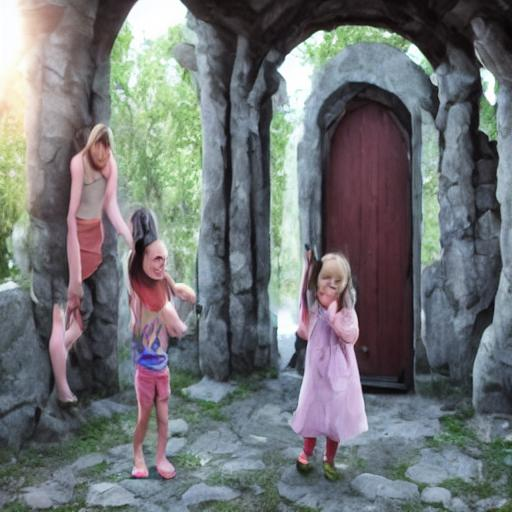

<!-- PROJECT LOGO -->
<br />
<p align="center">
  <h3 align="center">Stable-Diffusion-Chinese-Extend</h3>

  <p align="center">
   		A fine tune version of Stable Diffusion model on self-translate 10k diffusiondb Chinese Corpus and "extend" it
    <br />
  </p>
</p>

### Brief introduction
[Stable Diffusion](https://stability.ai/blog/stable-diffusion-public-release) is a state of the art text-to-image model that generates images from text.<br/>
Nowadays, with the help of [diffusers](https://github.com/huggingface/diffusers), which provides pretrained diffusion models across multiple modalities, people can customize their own image generator conditional (based on prompt) or unconditional.<br/>
This project focus on run the [text to image example](https://github.com/huggingface/diffusers/tree/main/examples/text_to_image) with self-translate data based on   [diffusiondb](https://github.com/poloclub/diffusiondb).<br/>
This repository create at 2022.11.5.
Recently, [IDEA-CCNL](https://github.com/IDEA-CCNL/Fengshenbang-LM) have released their [Taiyi-Stable-Diffusion-1B-Chinese-v0.1](https://huggingface.co/IDEA-CCNL/Taiyi-Stable-Diffusion-1B-Chinese-v0.1) in 2022.11.2. As a basic model train on massive dataset, it perform Chinese prompt to image generation task very well. The model trained on [wukong-dataset](https://wukong-dataset.github.io/wukong-dataset/), the dataset construct by many realistic style features. This makes the output slightly different with the original [CompVis/stable-diffusion-v1-4](https://huggingface.co/CompVis/stable-diffusion-v1-4)'s style. This may have some negative effect when one want to generate a image like original [CompVis/stable-diffusion-v1-4](https://huggingface.co/CompVis/stable-diffusion-v1-4) or a more valuable demand about use some modifier to make prompts more expressive.<br/>

The above idea is sourced from a project named [prompt-extend](https://github.com/daspartho/prompt-extend), it extending stable diffusion English prompts with suitable style cues using text generation.
And people can try it on [HuggingFace Space](https://huggingface.co/spaces/daspartho/prompt-extend).

Below are some examples about use [Taiyi-Stable-Diffusion-1B-Chinese-v0.1](https://huggingface.co/IDEA-CCNL/Taiyi-Stable-Diffusion-1B-Chinese-v0.1) to generate image with or without style cues in Chinese.
```python
from diffusers import StableDiffusionPipeline
pipe = StableDiffusionPipeline.from_pretrained("IDEA-CCNL/Taiyi-Stable-Diffusion-1B-Chinese-v0.1")
pipe = pipe.to("cuda")
pipe.safety_checker = lambda images, clip_input: (images, False)

prompt = '卡通龙'
image = pipeline(prompt, guidance_scale=7.5).images[0]
image

x = "卡通龙,数字艺术、艺术品趋势、电影照明、工作室质量、光滑成型"
image = pipeline(x, guidance_scale=7.5).images[0]
image
```
<table><caption>Images</caption>
<thead>
<tr>
<th>Prompt</th>
<th colspan="1">卡通龙</th>
<th colspan="1">卡通龙,数字艺术、艺术品趋势、电影照明、工作室质量、光滑成型</th>
</tr>
</thead>
<tbody>
<tr>
<td>卡通龙</td>
<td></td>
<td></td>
</tr>
</tbody>
</table>


You can check the output above, that the two outputs not have much differences in detail. This may reduce the imagination of the model and may
squeeze the space for fine creation.
<br/>

This project is target on implement [prompt-extend](https://github.com/daspartho/prompt-extend) in Chinese domain by fine tune [Taiyi-Stable-Diffusion-1B-Chinese-v0.1](IDEA-CCNL/Taiyi-Stable-Diffusion-1B-Chinese-v0.1) on a self-translate sampled data from [diffusiondb](https://github.com/poloclub/diffusiondb) and provide a text-generator that makes style cues works.
This project provide a finetuned version of [Taiyi-Stable-Diffusion-1B-Chinese-v0.1](IDEA-CCNL/Taiyi-Stable-Diffusion-1B-Chinese-v0.1) and a [MT5 model](https://huggingface.co/docs/transformers/model_doc/mt5) that generate style cues.

All models are upload to [Huggingface Hub](https://huggingface.co/svjack).

### Implementation details
To fine tune them, the only require are translated datasets. Firstly, I random sample 10k English samples from [diffusiondb](https://github.com/poloclub/diffusiondb) and use [NMT](https://en.wikipedia.org/wiki/Neural_machine_translation) translate them into Chinese with some corrections. It have upload to [svjack/diffusiondb_random_10k_zh_v1](https://huggingface.co/datasets/svjack/diffusiondb_random_10k_zh_v1) And use this dataset on base model will give us the demand. <br/>

The finetuned text to image model include three models named with <br/>
[svjack/Stable-Diffusion-FineTuned-zh-v0](https://huggingface.co/svjack/Stable-Diffusion-FineTuned-zh-v0)<br/>
[svjack/Stable-Diffusion-FineTuned-zh-v1](https://huggingface.co/svjack/Stable-Diffusion-FineTuned-zh-v1)<br/>
[svjack/Stable-Diffusion-FineTuned-zh-v2](https://huggingface.co/svjack/Stable-Diffusion-FineTuned-zh-v2)<br/>
This three models are trained with increase steps.(i.e. v0 stop early and v2 the last stop)

Secondly, I train a Chinese style cues generator based on MT5. In this step, i only need translated text features. The model is located in [svjack/prompt-extend-chinese](https://huggingface.co/svjack/prompt-extend-chinese)

### Usage
Refer the model cards in [Huggingface Hub](https://huggingface.co/svjack). Or locally. [predict_image.py](predict_image.py) only use the fine tuned stable diffusion model, [prompt_extend.py](prompt_extend.py) only predict style cues base on some short Chinese prompt strings, [predict_image_and_extend.py](predict_image_and_extend.py) merge them into one simple function.

### Results comparison
<table><caption>Images</caption>
<thead>
<tr>
<th>Prompt</th>
<th colspan="1">Taiyi-Stable-Diffusion-1B-Chinese-v0.1</th>
<th colspan="1">svjack/Stable-Diffusion-FineTuned-zh-v0</th>
<th colspan="1">svjack/Stable-Diffusion-FineTuned-zh-v1</th>
<th colspan="1">svjack/Stable-Diffusion-FineTuned-zh-v2</th>
</tr>
</thead>
<tbody>
<tr>
<td>卡通龙</td>
<td></td>
<td></td>
<td></td>
<td></td>
</tr>
<tr>
<td>卡通龙,数字艺术、艺术品趋势、电影照明、工作室质量、光滑成型</td>
<td></td>
<td></td>
<td></td>
<td></td>
</tr>
<tr>
<td>第一次世界大战</td>
<td></td>
<td></td>
<td></td>
<td></td>
</tr>
<tr>
<td>第一次世界大战,在艺术站的潮流,8,高度详细,高质量,高分辨率,获</td>
<td></td>
<td></td>
<td></td>
<td></td>
</tr>
<tr>
<td>女孩们打开了另一世界的大门</td>
<td></td>
<td></td>
<td></td>
<td></td>
</tr>
<tr>
<td>女孩们打开了另一世界的大门,由,和,制作,在艺术站上趋势,8,超宽角度,</td>
<td></td>
<td></td>
<td></td>
<td></td>
</tr>
</tbody>
</table>

### Discussion
The finetuned svjack/Stable-Diffusion-FineTuned-zh-vx models in V0, V1 and V2 are trained for 10000, 28000 and 56000 steps respectively on [svjack/diffusiondb_random_10k_zh_v1](https://huggingface.co/datasets/svjack/diffusiondb_random_10k_zh_v1). The V1 outperform others on imagination and sensitivity of style cues. Taiyi and V0 seems not imaginative, V2 seems not sensitive and become a totally rich style one.
The even line of above table's prompt are style cues generate by [MT5 model](https://huggingface.co/svjack/prompt-extend-chinese), the style cues works for V0 and V1, invalid in Taiyi and V2.
Try to use [svjack/Stable-Diffusion-FineTuned-zh-v0](https://huggingface.co/svjack/Stable-Diffusion-FineTuned-zh-v0) and
[svjack/Stable-Diffusion-FineTuned-zh-v1](https://huggingface.co/svjack/Stable-Diffusion-FineTuned-zh-v1) with [MT5 model](https://huggingface.co/svjack/prompt-extend-chinese) will give you a imagination and sensitivity of style cues outputs.

Sometimes, style cues may be important for sample migration finetuning. Below is a example. Use [svjack/Stable-Diffusion-FineTuned-zh-v1](https://huggingface.co/svjack/Stable-Diffusion-FineTuned-zh-v1), generate a imgae about "护国公克伦威尔"(Protector Cromwell), when without style cues, it 
gives a output like supernatural being, when add style cues generated by mt5 model "的肖像,由,和,制作,在艺术站上趋势", it give a relatively good output

<table><caption>Images</caption>
<thead>
<tr>
<th>Prompt</th>
<th colspan="1">护国公克伦威尔</th>
<th colspan="1">护国公克伦威尔,的肖像,由,和,制作,在艺术站上趋势</th>
</tr>
</thead>
<tbody>
<tr>
<td>护国公克伦威尔</td>
<td></td>
<td></td>
</tr>
</tbody>
</table>

<!-- CONTACT -->
## Contact

<!--
Your Name - [@your_twitter](https://twitter.com/your_username) - email@example.com
-->
svjack - svjackbt@gmail.com - ehangzhou@outlook.com

<!--
Project Link: [https://github.com/your_username/repo_name](https://github.com/your_username/repo_name)
-->
Project Link:[https://github.com/svjack/Stable-Diffusion-Chinese-Extend](https://github.com/svjack/Stable-Diffusion-Chinese-Extend)


<!-- ACKNOWLEDGEMENTS -->
## Acknowledgements
<!--
* [GitHub Emoji Cheat Sheet](https://www.webpagefx.com/tools/emoji-cheat-sheet)
* [Img Shields](https://shields.io)
* [Choose an Open Source License](https://choosealicense.com)
* [GitHub Pages](https://pages.github.com)
* [Animate.css](https://daneden.github.io/animate.css)
* [Loaders.css](https://connoratherton.com/loaders)
* [Slick Carousel](https://kenwheeler.github.io/slick)
* [Smooth Scroll](https://github.com/cferdinandi/smooth-scroll)
* [Sticky Kit](http://leafo.net/sticky-kit)
* [JVectorMap](http://jvectormap.com)
* [Font Awesome](https://fontawesome.com)
-->
* [Stable Diffusion](https://stability.ai/blog/stable-diffusion-public-release)
* [diffusers](https://github.com/huggingface/diffusers)
* [diffusiondb](https://github.com/poloclub/diffusiondb)
* [Taiyi-Stable-Diffusion-1B-Chinese-v0.1](IDEA-CCNL/Taiyi-Stable-Diffusion-1B-Chinese-v0.1)
* [prompt-extend](https://github.com/daspartho/prompt-extend)
* [EasyNMT](https://github.com/UKPLab/EasyNMT)
* [Stable-Diffusion-Pokemon](https://github.com/svjack/Stable-Diffusion-Pokemon)
* [svjack](https://huggingface.co/svjack)
