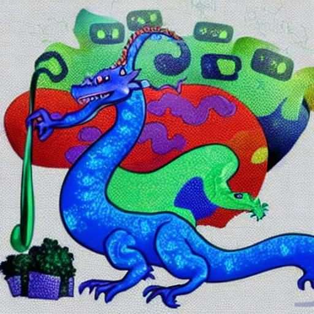
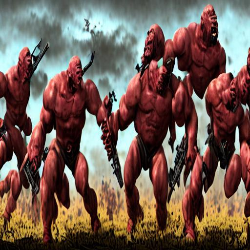
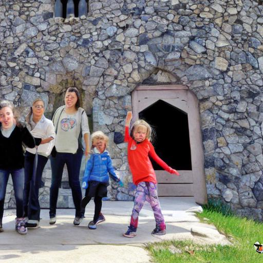

<br />
<p align="center">
  <h3 align="center">Stable-Diffusion-Chinese-Extend</h3>

  <p align="center">
      基于自翻译的一万条 diffusiondb 中文数据集的 Stable Diffusion 模型训练版本以及对提示文本的“扩展”
    <br />
  </p>
</p>

### 简要引述
[Stable Diffusion](https://stability.ai/blog/stable-diffusion-public-release)是现有的一流文本转图像模型。<br/>现如今借助提供跨模态预训练模型的框架[diffusers](https://github.com/huggingface/diffusers)，人们可以通过条件的或非条件的方式（是否提供提示文本）来定制化他们的图像生成器。<br/>这个工程聚焦于根据[text to image example](https://github.com/huggingface/diffusers/tree/main/examples/text_to_image)中的例子使用来自于[diffusiondb](https://github.com/poloclub/diffusiondb)的自翻译数据，达到类似的效果。
这个工程创建于2022.11.5.
现如今，[IDEA-CCNL](https://github.com/IDEA-CCNL/Fengshenbang-LM)在2022.11.2.开源了[Taiyi-Stable-Diffusion-1B-Chinese-v0.1](https://huggingface.co/IDEA-CCNL/Taiyi-Stable-Diffusion-1B-Chinese-v0.1) 。作为一个在大量数据上进行训练的基本模型，其在中文提示词生成图像的任务上表现优异。那个模型在具有很多现实风格特征的[wukong-dataset](https://wukong-dataset.github.io/wukong-dataset/)数据集上进行训练，使得其输出与原始的[CompVis/stable-diffusion-v1-4](https://huggingface.co/CompVis/stable-diffusion-v1-4)的风格有一些差异。这使得想要生成原始[CompVis/stable-diffusion-v1-4](https://huggingface.co/CompVis/stable-diffusion-v1-4)风格的图像或使得提示句子更具有表达力的时候面临一些困难。<br/>

上面使得提示句子更具有表达力的思路来自于一个叫做[prompt-extend](https://github.com/daspartho/prompt-extend)的工程，其使用文本生成任务扩展了stable diffusion的英语提示词。可以通过[HuggingFace Space](https://huggingface.co/spaces/daspartho/prompt-extend)这个Huggingface Space链接进行适用实验。

下面是使用[Taiyi-Stable-Diffusion-1B-Chinese-v0.1](https://huggingface.co/IDEA-CCNL/Taiyi-Stable-Diffusion-1B-Chinese-v0.1)生成一些图片的示例。

```python
from diffusers import StableDiffusionPipeline
pipe = StableDiffusionPipeline.from_pretrained("IDEA-CCNL/Taiyi-Stable-Diffusion-1B-Chinese-v0.1")
pipe = pipe.to("cuda")
pipe.safety_checker = lambda images, clip_input: (images, False)

prompt = '卡通龙'
image = pipeline(prompt, guidance_scale=7.5).images[0]
image

x = "卡通龙,数字艺术、艺术品趋势、电影照明、工作室质量、光滑成型"
image = pipeline(x, guidance_scale=7.5).images[0]
image
```
<table><caption>Images</caption>
<thead>
<tr>
<th>Prompt</th>
<th colspan="1">卡通龙</th>
<th colspan="1">卡通龙,数字艺术、艺术品趋势、电影照明、工作室质量、光滑成型</th>
</tr>
</thead>
<tbody>
<tr>
<td>卡通龙</td>
<td></td>
<td></td>
</tr>
</tbody>
</table>

你可以通过观看上面的输出发现，上面的两个结果在细节上的差异并不大。这样可能会减小模型的想象力并冻结模型进一步的创造空间。
<br/>

这个工程的目的是通过对[Taiyi-Stable-Diffusion-1B-Chinese-v0.1](IDEA-CCNL/Taiyi-Stable-Diffusion-1B-Chinese-v0.1)在根据 [diffusiondb](https://github.com/poloclub/diffusiondb)自翻译的部分数据的在中文领域实现[prompt-extend](https://github.com/daspartho/prompt-extend)的效果。并通过提供一个文本生成器使得风格化的能力得到强化。<br/>
本工程提供了[Taiyi-Stable-Diffusion-1B-Chinese-v0.1](IDEA-CCNL/Taiyi-Stable-Diffusion-1B-Chinese-v0.1)的微调版本以及 [MT5 model](https://huggingface.co/docs/transformers/model_doc/mt5)模型用来生成提示语句风格化辅助字符串。<br/>

所有模型已经上传到[Huggingface Hub](https://huggingface.co/svjack)。

### 实现细节
为了进行微调，需要翻译文本。
第一步，在[diffusiondb](https://github.com/poloclub/diffusiondb)中随机采样一万条数据，使用[NMT](https://en.wikipedia.org/wiki/Neural_machine_translation)将它们翻译成中文并进行简单修正。
这些生成后的文本已经被上传到 [svjack/diffusiondb_random_10k_zh_v1](https://huggingface.co/datasets/svjack/diffusiondb_random_10k_zh_v1) ，在基本模型上使用它们就会满足需求。

文本对图像的微调模型包含3个如下命名的模型<br/>
[svjack/Stable-Diffusion-FineTuned-zh-v0](https://huggingface.co/svjack/Stable-Diffusion-FineTuned-zh-v0)<br/>
[svjack/Stable-Diffusion-FineTuned-zh-v1](https://huggingface.co/svjack/Stable-Diffusion-FineTuned-zh-v1)<br/>
[svjack/Stable-Diffusion-FineTuned-zh-v2](https://huggingface.co/svjack/Stable-Diffusion-FineTuned-zh-v2)<br/>
这三个模型是按递增步数训练的（即，v0是训练的早期版本 v2是更多步数的训练版本）

第二步，我在MT5模型的基础上训练了一个提示语句风格辅助字符串文本生成模型。在这步中，仅仅需要完成文本的翻译，这个模型位于[svjack/prompt-extend-chinese](https://huggingface.co/svjack/prompt-extend-chinese) 以及一个基于GPT2的版本[svjack/prompt-extend-chinese-gpt](https://huggingface.co/svjack/prompt-extend-chinese-gpt) <br/>
GPT2在 HuggingFace Space有一个部署版本 位于[svjack/prompt-extend-gpt-chinese](https://huggingface.co/spaces/svjack/prompt-extend-gpt-chinese)

### 使用方法
根据工程本身的代码或[Huggingface Hub](https://huggingface.co/svjack)上的模型卡片进行使用。[predict_image.py](predict_image.py)这个文件仅仅使用微调后的文本转图像的生成模型。[prompt_extend.py](prompt_extend.py)仅仅根据头部的中文提示字符串生成风格辅助字符串。
[predict_image_and_extend.py](predict_image_and_extend.py)将二者结合进一个简单函数。


### 结果比较
<table><caption>Images</caption>
<thead>
<tr>
<th>Prompt</th>
<th colspan="1">Taiyi-Stable-Diffusion-1B-Chinese-v0.1</th>
<th colspan="1">svjack/Stable-Diffusion-FineTuned-zh-v0</th>
<th colspan="1">svjack/Stable-Diffusion-FineTuned-zh-v1</th>
<th colspan="1">svjack/Stable-Diffusion-FineTuned-zh-v2</th>
</tr>
</thead>
<tbody>
<tr>
<td>卡通龙</td>
<td></td>
<td></td>
<td></td>
<td></td>
</tr>
<tr>
<td>卡通龙,数字艺术、艺术品趋势、电影照明、工作室质量、光滑成型</td>
<td></td>
<td></td>
<td></td>
<td></td>
</tr>
<tr>
<td>第一次世界大战</td>
<td></td>
<td></td>
<td></td>
<td></td>
</tr>
<tr>
<td>第一次世界大战,在艺术站的潮流,8,高度详细,高质量,高分辨率,获</td>
<td></td>
<td></td>
<td></td>
<td></td>
</tr>
<tr>
<td>女孩们打开了另一世界的大门</td>
<td></td>
<td></td>
<td></td>
<td></td>
</tr>
<tr>
<td>女孩们打开了另一世界的大门,由,和,制作,在艺术站上趋势,8,超宽角度,</td>
<td></td>
<td></td>
<td></td>
<td></td>
</tr>
</tbody>
</table>

### 讨论
微调的svjack/Stable-Diffusion-FineTuned-zh-vx模型的V0, V1 及 V2各自在[svjack/diffusiondb_random_10k_zh_v1](https://huggingface.co/datasets/svjack/diffusiondb_random_10k_zh_v1)上训练了10000, 28000 及 56000 步（batch_size 1）<br/>
V1版本在想象力以及对风格的敏感度上超过了其它的版本。Taiyi及V0看起来想象力不足，V2看起来并不敏感而是作为一个极具风格化的版本。<br/>
上面表格的偶数行是[MT5 model](https://huggingface.co/svjack/prompt-extend-chinese)生成的风格化辅助字符串的结果。风格化辅助字符串对于V0以及V1是有效的，对于Taiyi以及V2作用不明显。<br/>
尝试使用结合 [MT5 model](https://huggingface.co/svjack/prompt-extend-chinese) 使用 [svjack/Stable-Diffusion-FineTuned-zh-v0](https://huggingface.co/svjack/Stable-Diffusion-FineTuned-zh-v0) 及
[svjack/Stable-Diffusion-FineTuned-zh-v1](https://huggingface.co/svjack/Stable-Diffusion-FineTuned-zh-v1) 会给你一个既有想象力又对于辅助风格敏感的结果，

一些情况下，风格化辅助字符串对于样本迁移微调具有很大帮助。下面是一个例子，使用
[svjack/Stable-Diffusion-FineTuned-zh-v1](https://huggingface.co/svjack/Stable-Diffusion-FineTuned-zh-v1)生成一个有关"护国公克伦威尔"(Protector Cromwell)的图片，在不使用风格化辅助字符串的情况下，其给出的结果类似中国古代的神仙门神画作，但当加上mt5模型生成的风格化辅助字符串"的肖像,由,和,制作,在艺术站上趋势"后，其生成的结果更符合预期。

<table><caption>Images</caption>
<thead>
<tr>
<th>Prompt</th>
<th colspan="1">护国公克伦威尔</th>
<th colspan="1">护国公克伦威尔,的肖像,由,和,制作,在艺术站上趋势</th>
</tr>
</thead>
<tbody>
<tr>
<td>护国公克伦威尔</td>
<td></td>
<td></td>
</tr>
</tbody>
</table>

<!-- CONTACT -->
## Contact

<!--
Your Name - [@your_twitter](https://twitter.com/your_username) - email@example.com
-->
svjack - svjackbt@gmail.com - ehangzhou@outlook.com

<!--
Project Link: [https://github.com/your_username/repo_name](https://github.com/your_username/repo_name)
-->
Project Link:[https://github.com/svjack/Stable-Diffusion-Chinese-Extend](https://github.com/svjack/Stable-Diffusion-Chinese-Extend)


<!-- ACKNOWLEDGEMENTS -->
## Acknowledgements
<!--
* [GitHub Emoji Cheat Sheet](https://www.webpagefx.com/tools/emoji-cheat-sheet)
* [Img Shields](https://shields.io)
* [Choose an Open Source License](https://choosealicense.com)
* [GitHub Pages](https://pages.github.com)
* [Animate.css](https://daneden.github.io/animate.css)
* [Loaders.css](https://connoratherton.com/loaders)
* [Slick Carousel](https://kenwheeler.github.io/slick)
* [Smooth Scroll](https://github.com/cferdinandi/smooth-scroll)
* [Sticky Kit](http://leafo.net/sticky-kit)
* [JVectorMap](http://jvectormap.com)
* [Font Awesome](https://fontawesome.com)
-->
* [Stable Diffusion](https://stability.ai/blog/stable-diffusion-public-release)
* [diffusers](https://github.com/huggingface/diffusers)
* [diffusiondb](https://github.com/poloclub/diffusiondb)
* [Taiyi-Stable-Diffusion-1B-Chinese-v0.1](IDEA-CCNL/Taiyi-Stable-Diffusion-1B-Chinese-v0.1)
* [prompt-extend](https://github.com/daspartho/prompt-extend)
* [EasyNMT](https://github.com/UKPLab/EasyNMT)
* [Stable-Diffusion-Pokemon](https://github.com/svjack/Stable-Diffusion-Pokemon)
* [svjack](https://huggingface.co/svjack)
